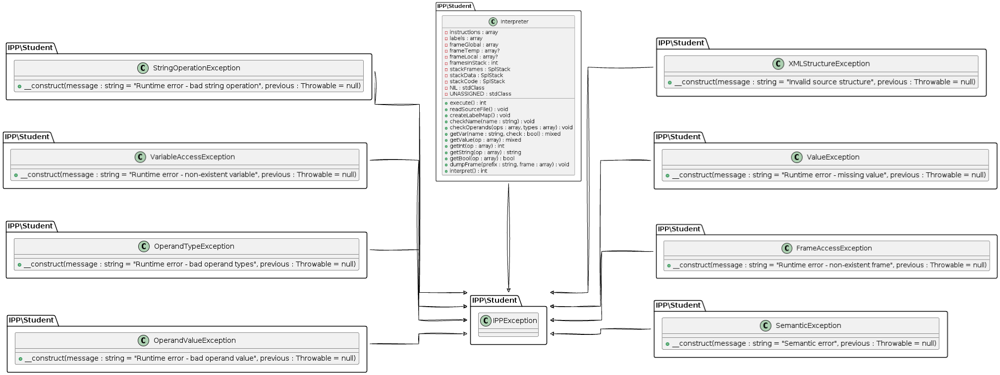

---

# Dokumentace pro `interpret.php` a související výjimky

## Basic Information

- **Name and Surname**: Zverev Daniil
- **xlogin** : xzvere00
## Interpret
Hlavní třída `Interpreter` slouží jako jádro interpretu jazyka IPPcode24. Interpret načítá instrukce ve formátu XML, ověřuje je a provádí, simulující chování virtuálního stroje.

### Načítání XML
Metoda `readSourceFile()` zpracovává XML soubor, ověřuje jeho strukturu a připravuje instrukce pro interpretaci. Kontrola zahrnuje ověření kořenového elementu a atributů jednotlivých instrukcí.

### Interpretace instrukcí
Po úspěšném načtení XML souboru `interpret()` metoda sekvenčně prochází instrukce a vykonává je podle specifikace jazyka IPPcode24. Třída obsahuje vnitřní metody pro manipulaci s datovými strukturami, jako jsou zásobníky a rámce pro proměnné.

## Výjimky
Skript obsahuje několik vlastních výjimek, které odvozují od třídy `IPPException`. Tyto výjimky reprezentují různé chybové stavy, které mohou vzniknout během interpretace kódu.

### `FrameAccessException`
Vyvolána, pokud je požadován přístup k neexistujícímu rámci proměnných.

### `OperandTypeException`
Vyvolána, pokud operace narazí na operand nesprávného typu.

### `OperandValueException`
Vyvolána v případě, že hodnota operandu není validní pro danou operaci.

### `SemanticException`
Vyvolána při sémantické chybě v zdrojovém kódu IPPcode24.

### `StringOperationException`
Reprezentuje chyby při operacích se stringy.

### `ValueException`
Indikuje, že byla vykonána operace s chybějící hodnotou.

### `VariableAccessException`
Vyvolána, když se pokoušíme přistupovat k neexistující proměnné.

### `XMLStructureException`
Signálizuje chybu v struktuře XML souboru obsahujícího zdrojový kód IPPcode24.

## UML Diagram
UML diagram je přiložen odděleně a obsahuje vizuální reprezentaci vztahů mezi třídami `Interpreter` a výjimek. Zobrazuje hierarchii dědičnosti a členy každé třídy.

---

